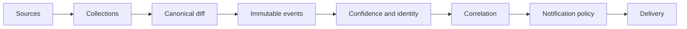

# Signal Forge

**Know what changed in AI before it's announced, with the receipts to prove it.**

Models show up in API catalogs before the blog post goes live. Arena codenames appear weeks before
anyone names them. Docs pages, package releases and pricing tables change quietly, and by the time
it's news, somebody else already has the story.

Signal Forge watches those surfaces for you. It keeps the before/after evidence for every change,
labels how far the source can be trusted, and sends a card to Discord or Telegram only when it's
worth reading.

Built with Bun, TypeScript and SQLite. One process, one database file, no cloud services required.
MIT licensed.

```text
🆕 New model available · GPT-5
OpenRouter · OpenAI

What changed
Listed and selectable.

Reader impact
Available to use from this catalogue.

Confirmed · availability catalogue
Detected a few minutes ago
```

## Why use it

- **Early.** It reads the places things show up first: provider model catalogs, arenas, package
  registries, GitHub, Hugging Face, docs, changelogs, status pages, and new pages on vendor sites.
- **Honest.** Every event carries a confidence label taken from its source. An arena codename stays
  a codename until another source says what it is. An observation never becomes a stronger claim
  than its evidence supports.
- **Quiet.** Price jitter, back-and-forth changes and scheduled tier moves are stored but don't
  trigger a message. A price that falls in six steps arrives as one card about the whole fall.
- **Reliable.** A failed fetch never turns into "every model disappeared." A message that may or may
  not have gone out is never sent a second time.
- **Scriptable.** Every operation is available from the CLI, over HTTP and as an MCP tool, so your
  AI agent can ask it what changed this week and look at the evidence itself.

## What it watches

| Surface | Examples |
| --- | --- |
| Model catalogs | First-party OpenAI, Anthropic, Gemini and DeepSeek catalogs; OpenRouter availability and pricing; Vercel AI Gateway |
| Arenas and leaderboards | Arena appearances, codenames and rank changes; DesignArena; Artificial Analysis image, video and speech arenas |
| Open weights | Hugging Face accounts of the labs you follow, plus trending models from everyone else (original models only, no quantisations or fine-tunes, under two weeks old) |
| Code and packages | GitHub commits, pull requests and releases; npm and PyPI releases; discovery of new AI, LLM, agent and MCP repositories |
| Official word | OpenAI news, ChatGPT release notes, Codex and API changelogs, Anthropic, Gemini, xAI, Mistral, Groq, DeepSeek, Hugging Face, Claude Code |
| Lifecycle | Deprecation and retirement pages for OpenAI, Anthropic, Google, AWS, Azure, Groq, Cohere and xAI, with reminders as deadlines get close |
| Everything else | Mobile app releases with their release notes, new pages on vendor sites, platform incidents, Hacker News stories (used to back up other signals, never sent as a card on their own) |

Each source is optional: turn it on, give it a credential if it needs one, and it gets scheduled.

## Quick start

You need [Bun](https://bun.sh) 1.3.14 or newer.

```sh
git clone https://github.com/alexgetmancom/signal-forge.git
cd signal-forge

bun install --frozen-lockfile
cp .env.example .env
cp signal-forge.example.json signal-forge.json

bun run check   # formatting, types, tests, migrations, architecture, build
bun run dev
```

Most sources need no key. Sources that need one and don't have it are listed as `missing` rather
than failing quietly. The first run records a baseline and sends nothing. After that you only hear
about changes.

To see what it has found before you connect a channel:

```sh
bun src/cli.ts status     # what is running, missing or failing, and why
bun src/cli.ts stories    # related events grouped around one model or product
bun src/cli.ts models     # the best known facts per model, each with its source
```

Prefer Docker? The included `compose.yaml` runs the same service with a health check, bounded
logs and the database mounted from `./data`:

```sh
docker compose up -d --build
```

## How it works



Collectors don't know Discord or Telegram exist, and storage doesn't depend on delivery. CI checks
these boundaries and rejects circular dependencies.

### Confidence: how far to trust it

| Label | Meaning |
| --- | --- |
| `observed` | Visible in public technical evidence, not independently confirmed |
| `supported` | Backed by an official statement or a related source |
| `confirmed` | Present in a first-party product or API |
| `shipped` | Published as a release |

### Signal class: whether you care

Trust and interest are different things. An unnamed arena codename is the weakest evidence in the
system and often the most interesting item. A first-party retirement date moving by a week is the
strongest evidence and usually the least interesting.

So each event also gets a class from its own evidence, and each channel subscribes to classes, not
to sources:

- `launch`: usable now, or a severe outage has just started
- `codename`: something is coming
- `retirement`: the vendor says a model or feature is going away
- `release`: a tool shipped a build
- `change`: a number moved
- `evidence`: the raw trail
- `reminder`: follow-up work for the operator

Only `launch` and `codename` ping a role.

### From codename to release

A model can first appear as an unresolved arena codename, then show up in a provider catalog, then
ship as an official release. Signal Forge keeps each of those observations as a separate event and
connects them as a single **story** once there's enough evidence to identify the model. Stories
expose event IDs, `canonicalId`, `identityStatus` and aliases, so you can always check which evidence
a connection rests on.

On top of the events there's a deterministic analysis layer. None of it creates new evidence:

- **Model facts:** the best known fields for each model, each with its source, event ID and
  confidence.
- **Hypotheses:** interpretations of a story's timeline that link to the events behind them but are
  never evidence themselves.
- **Source quality:** signal density, how often a source was first, how often it was independently
  confirmed, and median lead time. Four queries from one source family count as one confirmation,
  not four.
- **Lifecycle deadlines:** reminders built from deprecation evidence. Rebuilding them never creates
  duplicates.
- **Attention score:** how GitHub discovery ranks new repositories by recency, popularity and
  relevance. It helps you sort candidates and never affects confidence.

### Keeping the channel useful

Three kinds of movement are stored without a notification:

- a base price landing on a tier the source itself publishes (the schedule working as planned, not
  a reprice);
- a value that goes back to a level it already held within the same window after moving at least
  twice;
- a number that keeps sliding. It waits, and the card that eventually goes out compares against the
  last state the reader actually saw.

When a major outage ends, its existing card is edited instead of a second message being posted.
Each channel can get a weekly recap on Sunday evening, and scouts can get a daily one at 06:00 UTC
with the smaller price moves and leaderboard changes that didn't earn their own card.

New sources can run in **shadow mode**: they store snapshots and events and count toward stories
and metrics, but they send nothing until you promote them. GitHub discovery starts in shadow mode.

## Configuration

Secrets go in `.env`, and only the ones you need. Behavior goes in `signal-forge.json`:

```json
{
  "pollSeconds": 300,
  "sourceEnabled": { "openai": true, "anthropic": true, "gemini": true },
  "sourceMode": { "discovery:github-ai": "active" },
  "destinations": []
}
```

- `sourceEnabled` controls whether a collector runs. A source that's turned on but has no credential
  shows up as `missing` and isn't scheduled.
- `sourceMode` controls delivery: `active` can notify, while `shadow` stores everything and sends
  nothing.
- `destinations` sets the channels, the signal classes each one subscribes to, role mentions, status
  boards and promotion thresholds. `signal-forge.example.json` shows the format.

| Variable | Enables |
| --- | --- |
| `OPENAI_API_KEY`, `ANTHROPIC_API_KEY`, `GEMINI_API_KEY` | First-party model catalogs |
| `DEEPSEEK_API_KEY` | DeepSeek's catalog, plus optional one-sentence summaries of large diffs |
| `GITHUB_TOKEN` | Raises the GitHub limit from 60 to 5,000 requests per hour |
| `HF_TOKEN` | Your own Hugging Face Hub allowance instead of the shared anonymous one |
| `DISCORD_BOT_TOKEN`, `TELEGRAM_BOT_TOKEN` | Delivery |
| `MCP_TOKEN` | The HTTP and MCP API (at least 32 random characters) |

Summaries are optional. If a summary is missing or fails, the card goes out with the original
evidence. Every summary call is logged with its token usage, cache hits and USD cost (see
`bun src/cli.ts deepseek-usage 30`), so the spend is always visible.

GitHub cards show the commit or pull request title, a summary when the diff is large, and compact
change stats. The raw patch stays in the database. `github` entries accept `repo` and `paths`.

## Delivery you can trust

- Discord is running in production. Telegram is implemented and tested.
- Snapshots, events and delivery jobs commit in one SQLite transaction, so an event can't be saved
  without its delivery job.
- A successful send is never retried. HTTP 429 retry timing is respected.
- If the outcome of a send is uncertain, the delivery is marked `ambiguous` and is never resent
  automatically. You check the channel and record what actually happened.
- A card can be shortened for the channel, but the full evidence stays in SQLite.

## Operate it from anywhere

Each operation is defined once in `src/operations.ts`. The CLI, its help text, the HTTP routes, the
MCP tool list and the `guide` index are all generated from that definition, so they can't drift
apart.

```sh
bun src/cli.ts guide                             # "something looks wrong": where to start
bun src/cli.ts doctor                            # health, broken down by cause
bun src/cli.ts issues
bun src/cli.ts signal-quality 7
bun src/cli.ts hypotheses
bun src/cli.ts lifecycle-deadlines
bun src/cli.ts deliveries-needing-verification
bun src/cli.ts code-analytics 7                  # hourly timings and failures, kept 90 days
bun src/cli.ts journal                           # who changed what, and from which surface
```

`bun src/cli.ts help` prints the full list. Operations that change stored state are marked
`[mutates]`, say so before they run, and are recorded in the operator journal. Operations that touch
credentials or the host, such as `poll` and `clear-credential-circuit`, are left out of MCP on
purpose.

The health report doesn't collapse everything into healthy or unhealthy. It tells you whether a
credential is missing, a source is intentionally off, an upstream is blocking you, a collection
failed or a delivery failed.

### HTTP and MCP

Send `Authorization: Bearer $MCP_TOKEN` to `/api/status`, `/api/events`, `/api/events/:id`,
`/api/models`, `/api/models/*`, `/api/hypotheses`, `/api/hypotheses/:id`, `/api/deadlines`,
`/api/code-analytics`, `/api/deepseek-usage`, `/api/doctor`, `/api/guide`, `/api/journal`,
`/api/credentials`, `/reports/:id`, or connect an MCP client to `/api/mcp`.

MCP tools: `doctor`, `status`, `issues`, `capabilities`, `date_integrity`, `deliveries`,
`deliveries_needing_verification`, `require_delivery_verification`, `resolve_delivery_verification`,
`suppressions`, `events`, `event`, `stories`, `models`, `model`, `hypotheses`, `hypothesis`,
`lifecycle_deadlines`, `lead_time`, `signal_quality`, `code_analytics`, `deepseek_usage`,
`credential_circuits`, `journal`.

### Publication archive

Signal Forge can also read published posts and their per-platform outcomes from Solo Publisher every
15 minutes (set `SOLO_PUBLISHER_MCP_URL` and `SOLO_PUBLISHER_MCP_TOKEN`, then run
`bun src/cli.ts publications`). It starts from the latest 50 text publications and keeps posts it
has already seen. These rows never create events or notifications. Coverage limits and access
rules are documented at the top of `src/publications.ts`.

## Built for things that fail

External sources time out, throttle, return half a page or change their format without warning.
Signal Forge is built with that in mind:

- every external response is validated before it can change stored state
- conditional HTTP requests and caching; immutable assets are fetched once
- per-upstream pacing and rate-limit handling, with explicit states for what each source can do
- versioned SQLite migrations, rehearsed before they run
- nightly backups that check their own integrity
- architecture, dead-code, dependency-audit and migration checks in `bun run check` and CI, and
  Docker builds validated in CI

## Development

```sh
bun run check   # the gate: everything CI enforces
bun run dev     # watch mode
bun run poll    # one collection, queue not sent
```

Use a separate database and destination config for local work. Stop the dev server before
`bun run poll`, because only one collector should run per database. In an existing checkout, don't
overwrite the deployment's `.env` or `signal-forge.json`.

Production deployment, backup, restore and day-to-day procedures are in the
[operator runbook](docs/runbook.md). Hosts, paths and credentials stay out of the repository.

## Status

Signal Forge runs continuously in production and is judged by the quality of what it sends. As
measured on 2026-09-19, the deployment covered 123 sources (112 active, 11 in shadow mode) and had
stored 17,068 events and sent 532 cards to two Discord channels, all in a 617 MB database. Current
priorities are restore testing, accurate outage durations and adding sources carefully. The plan,
along with the decisions measurement has already settled, is in [docs/roadmap.md](docs/roadmap.md).

## License

[MIT](LICENSE): use it, fork it, run it for your own team or product. Keep the copyright notice.
