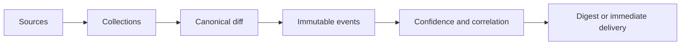

# Signal Forge

Signal Forge is a compact Bun + TypeScript + SQLite observability service for changes in AI models,
developer tools, documentation, packages, arenas, incidents and platform catalogues.

It is for readers who need evidence before a normal news feed catches up: a model appearing in an
arena, an API catalogue changing, a package shipping, a documentation page gaining a capability,
or a platform incident moving state. It preserves before/after data, labels source confidence,
correlates related evidence and delivers only the changes that pass the current notification policy.

## What it watches

- First-party model catalogues and OpenRouter availability and pricing.
- Arena appearances and leaderboard movement, including early codenames.
- GitHub commits, pull requests and releases for watched repositories.
- npm and PyPI releases, open-weight registries, documentation and official news.
- Vendor status pages, incident updates and deprecation notices.

## Why this is different

An observation is not presented as a fact stronger than its source. A public bundle string is
`observed`, an official announcement is `supported`, a first-party catalogue is `confirmed`, and a
published release is `shipped`. Every notification keeps the event's immutable before/after evidence.

The notification policy also filters price noise. A pricing change is omitted when it is at most
$0.01 per 1M tokens and below 10% of the model's price; the observation and before/after event stay
in SQLite. Larger changes, or a smaller absolute change that materially changes a cheap model's
price, remain visible.

Example event:

```text
🆕 New · OpenRouter
GPT-5
Provider: OpenAI
Signal Forge · availability catalogue · confirmed · 08 Sep 02:00 UTC
```

## How it works



Collectors are declared in one source registry. SQLite migrations build fresh and upgraded
databases through the same path. CLI, HTTP and MCP expose one shared operations layer.

## Run it

```sh
bun install --frozen-lockfile
cp signal-forge.example.json signal-forge.json
bun run check
bun run dev
```

Use a separate development database and destination configuration. The first source observation is
quiet; later changes are compared against the stored record.

## Architecture

`src/sources/registry.ts` owns source metadata and scheduler projections. Event canonicalization,
diffing, interpretation, identity, rendering, batching and persistence live in separate modules. Storage does
not know about Discord or Telegram, and collectors do not know about delivery. Versioned SQL files
in `src/storage/migrations/` are checked for strict numbering in CI.

## Operations

```sh
bun src/cli.ts status
bun src/cli.ts issues
bun src/cli.ts signal-quality 7
bun src/cli.ts stories
bun src/cli.ts deliveries-needing-verification
```

Operational APIs require the bearer token. Ambiguous sends are never retried blindly; inspect the
destination, require manual delivery verification, then record the outcome as sent or failed. Stories
expose event IDs so an agent can fetch
full evidence and prepare a separate publication draft without a code or database dependency. Story
views also expose `canonicalId`, `identityStatus` and aliases. Arena codenames remain unresolved until
another source supplies a canonical identity.

Outstanding work is in [WORKING-NOTES.md](WORKING-NOTES.md).

The independent handoff pattern for an agent preparing publication drafts is in
[docs/agent-workflow.md](docs/agent-workflow.md).

Telegram delivery is implemented and tested but has no destination configured: the audience is on
Discord. Re-enabling it is one entry in `signal-forge.json`, which is why the code stays.

## Deployment

The production instance, backup, restore and operator commands live in the
[operator runbook](docs/runbook.md). Deployment-specific hosts, paths and credentials stay outside
the repository.

## Boards

Two messages are edited in place instead of being reposted, so a channel holds a state rather than
a log. Both are rewritten only when their content actually changed — editing an unchanged board
would mark the channel unread for everyone watching it. Deleting a board by hand makes the next
cycle post a fresh one, which is also how their order in the channel is fixed.

**Platform health** (`platformBoardChannelId`, defaults to the status channel) shows what OpenAI's
and Anthropic's own status pages say, with their open incidents. Vendors that do not run Statuspage
are absent on purpose: `status.x.ai` refuses its own API, and Google publishes a different document
for the whole cloud.

**Tracker status** (`statusChannelId`) is about us: every collector with a coloured dot, grouped with
its last successful observation, edited in place every five minutes. The board also shows delivery
queue state and unavailable integrations. It is rewritten only when something actually changed, so
the channel holds a board rather than a log, and deleting the message by hand makes the next cycle
post a fresh one.

A blocked source is not a broken one. `gemini` answers everywhere except the addresses this project
can reach, so it shows as restricted with its cause instead of counting against the headline — a
board that calls every silence an outage teaches people to ignore it.

## Alerts

`alertChannelId` names a private channel that receives one message when a collector stops
reporting and one when it recovers — never a repeat while the same outage continues. This is
operational noise for the owner, not content for subscribers, so it does not go to a feed channel.
A rejected alert leaves the stored state untouched, so the next cycle retries rather than losing
the transition.

## Configuration

Set `DISCORD_BOT_TOKEN` in `.env`. Configure destinations in `signal-forge.json`:

```json
{
  "pollSeconds": 300,
  "destinations": [
    {
      "id": "discord-model-catalog",
      "platform": "discord",
      "channelId": "000000000000000000",
      "streams": ["api-models", "openrouter", "weights"]
    }
  ],
  "statusChannelId": "000000000000000000",
  "alertChannelId": "000000000000000000",
  "vendorRoles": { "OpenAI": "000000000000000000" }
}
```

Replace the example IDs with the actual ones. Deploy after configuration changes.

`vendorRoles` maps a vendor, as `vendorOf()` resolves it, to the role that follows that vendor. A
role is pinged only when a model appears or disappears — a price edit travels in the same message
without waking anyone — and never from a digest. The permitted mention list names exactly the roles
the message mentions, so a stray ID cannot ping. Mentioning a role that is not "mentionable"
requires the bot to hold *Mention @everyone, @here and All Roles* in that channel; a channel that
still inherits its category's permissions gets this automatically.

Timestamps: Discord messages carry `<t:unix:f>`, which every reader sees in their own timezone;
Telegram has no such markup and gets a fixed UTC stamp built without `Intl`, because the runtime's
ICU data disagrees with itself about whether `short` is "Sep" or "Sept".

Discord destinations take a `channelId` and the same `streams`. A bot only reaches a private
category when its role is granted `VIEW_CHANNEL` there; creating channels additionally needs
`MANAGE_CHANNELS`, which the bot does not have and does not need for delivery. Verify a new channel
with one manual `POST /channels/<id>/messages` before relying on it — a destination that cannot be
written to only shows up as a failed delivery later.
Destinations receive future events only. The first source observation is quiet.

API catalogue collectors are requested by default. Set `sourceEnabled` to `false` for a source that
is intentionally disabled; a requested source without its credential is reported as `missing` and is
not scheduled. Set `OPENAI_API_KEY`, `ANTHROPIC_API_KEY` and `GEMINI_API_KEY` for their catalogues.
Set `REPORT_BASE_URL` to the LAN origin used for full web-diff links.
Set `GITHUB_TOKEN` to raise the GitHub request allowance from 60 to 5000 an hour. Listing requests
are conditional, and a 304 costs no quota at all. Optional `github` entries accept
`repo` and `paths`; the default repository is `openai/codex`.
Set `HF_TOKEN` to use the account's Hub API allowance instead of the anonymous allowance shared by
the machine's public address.

## Request footprint

Observations are conditional wherever a server offers a validator: `http_cache` stores the body
with its `ETag`, and an unchanged page answers 304 with no body. Assets served `immutable` — the
Claude bundle, whose filenames carry a content hash — are not requested again at all, which took
one observation from 608 requests and 21 MB to 2 requests and 0.1 MB. A body arriving without a
validator is deliberately not stored, since the next observation must download it regardless.

## Inspect delivery problems

Source errors appear in `status`; HTTP readiness does not imply all sources are healthy.
Inspect delivery outcomes with:

```sh
bun dist/src/cli.js deliveries
bun dist/src/cli.js event 1
```

Successful sends are never retried. HTTP 429 honors retry timing. Uncertain sends are marked
`ambiguous` and never automatically repeated; inspect the actual chat before considering a resend.
Full event evidence remains in the database even when a message excerpt is truncated.

For HTTP/MCP access, set `MCP_TOKEN` to at least 32 random characters and use
`Authorization: Bearer <token>` with `/api/status`, `/api/events`, `/api/events/:id` or `/api/mcp`.
MCP operations: `status`, `events`, `event`, `deliveries`, `issues`, `capabilities`,
`deliveries_needing_verification`, `require_delivery_verification`, `resolve_delivery_verification`,
`signal_quality` and `stories`.

## Local development

Use a separate development database and destination configuration.

```sh
bun install --frozen-lockfile
```

On a fresh checkout, create `.env` and `signal-forge.json` from their example files.
Do not overwrite the deployment configuration in an existing checkout.

```sh
bun run dev
bun run check
```

`bun run poll` collects once without sending the queue. Stop the development server before
using it; run only one collector per database.
