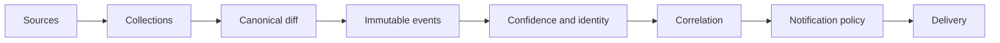

# Signal Forge

Evidence-first monitoring for changes across the AI ecosystem.

Signal Forge watches model catalogs, arenas, package registries, GitHub repositories, documentation, official announcements, and platform status pages for meaningful changes.

Instead of forwarding every diff as news, it preserves the underlying before/after evidence, assigns confidence based on the source, correlates related signals, and delivers only events that pass the notification policy.

Built with Bun, TypeScript, and SQLite.

## What it detects

* First-party model catalogs from AI providers
* OpenRouter model availability and pricing
* Arena appearances, codenames, and leaderboard movement
* GitHub commits, pull requests, and releases
* npm and PyPI package releases
* Hugging Face and other open-weight registries
* Product documentation and changelogs
* Official vendor announcements
* Platform incidents and service status
* Model deprecations and lifecycle changes

## Why Signal Forge exists

AI products often change before there is a conventional announcement.

A model may appear in an API catalog before a blog post. A codename may surface in an arena before its identity is known. Documentation may expose a capability before it reaches a news feed. A package or repository may ship before broader coverage appears.

Signal Forge is designed to capture those early signals without overstating what they mean.

Each event retains its source and immutable before/after evidence.

Confidence is derived from the evidence:

* `observed`: visible in public technical evidence, but not independently confirmed
* `supported`: backed by an official statement or related source
* `confirmed`: present in a first-party product or API surface
* `shipped`: published as a release

An observation never becomes a stronger claim than its source supports.

## Example

A model might first appear as an unresolved arena codename, later show up in a provider catalog, and eventually ship as an official release.

Signal Forge keeps those observations separate while correlating them around the same identity as stronger evidence becomes available.

Example notification:

```text
🆕 New · OpenRouter
GPT-5
Provider: OpenAI
Signal Forge · availability catalogue · confirmed · 08 Sep 02:00 UTC
```

## Signal, not noise

Not every detected change becomes a notification.

For example, insignificant pricing fluctuations can remain recorded in SQLite without generating an alert. Larger or materially significant changes remain visible.

Failed or malformed source responses are never interpreted as empty catalogs, and uncertain message deliveries are never blindly retried.

The goal is to preserve evidence while keeping the reader-facing signal useful.

## Architecture



The system keeps collection, event processing, persistence, rendering, and delivery separate.

Collectors do not know about Discord or Telegram. Storage does not depend on transport adapters. Architectural boundaries and circular dependencies are checked automatically in CI.

## Quick start

Requirements:

* Bun 1.3.14 or newer

```sh
git clone https://github.com/alexgetmancom/signal-forge.git
cd signal-forge

bun install --frozen-lockfile
cp signal-forge.example.json signal-forge.json

bun run check
bun run dev
```

The first observation establishes the baseline and does not emit change notifications. Later observations are compared against the stored state.

Some collectors require provider credentials. See the configuration section below for optional integrations.

## Source coverage

The current source registry covers:

* OpenRouter and optional first-party catalogs for OpenAI, Anthropic, and Gemini, plus the Vercel AI Gateway feed
* Arena appearances, leaderboards, and DesignArena categories
* Hugging Face open-weight repositories
* npm and PyPI packages
* GitHub commits, pull requests, and releases for selected repositories
* Official OpenAI Help Center and news, Anthropic Platform, Gemini API, xAI, Mistral, Groq, DeepSeek, Google DeepMind, NVIDIA, and Hugging Face release surfaces, plus Codex documentation and Claude Code/Anthropic SDK releases
* Provider lifecycle and deprecation pages for OpenAI, Anthropic, Google, AWS, Azure, Groq, Cohere, and xAI

Provider credentials and upstream availability determine which optional sources can run. A failed or malformed collection is never treated as an empty catalog; external responses are validated before they can change stored state.

## Configuration

Copy `.env.example` to `.env` and set only the credentials required by the sources and destinations you enable. Configure polling, source selection, and destinations in `signal-forge.json`:

```json
{
  "pollSeconds": 300,
  "sourceEnabled": {
    "openai": true,
    "anthropic": true,
    "gemini": true
  },
  "destinations": []
}
```

API catalog collectors are requested by default. Set `sourceEnabled` to `false` for a source that is intentionally disabled; a requested source without its credential is reported as `missing` and is not scheduled.

Set `OPENAI_API_KEY`, `ANTHROPIC_API_KEY`, and `GEMINI_API_KEY` for their catalogs. Set `DEEPSEEK_API_KEY` to enable one-sentence summaries for large, publishable diffs after deterministic noise filtering; a missing key or failed summary call leaves the original evidence unchanged and never blocks delivery. Discord and Telegram keep the title and compact source evidence alongside the optional summary.

GitHub notifications show the commit or pull-request title, a one-sentence summary when a large diff warrants it, and compact change statistics; raw patch evidence remains internal. Set `GITHUB_TOKEN` to raise the GitHub request allowance from 60 to 5,000 per hour. Optional `github` entries accept `repo` and `paths`; the default repository is `openai/codex`. Set `HF_TOKEN` to use the account's Hub API allowance instead of the anonymous allowance shared by the machine's public address.

See [docs/discord.md](docs/discord.md) for Discord destination, channel, board, role, and permission configuration.

## Delivery

Signal Forge currently delivers reader-facing signals to Discord. Telegram support is implemented and tested but is not enabled in the production configuration.

Delivery is designed to avoid duplicate or misleading notifications. Successful sends are never retried, rate limits are respected, and ambiguous outcomes require explicit operator verification rather than automatic resending.

See [docs/discord.md](docs/discord.md) for channel configuration, status boards, role mentions, permissions, and delivery behavior.

## Operations

Signal Forge exposes the same operational model through CLI, HTTP, and MCP interfaces.

```sh
bun src/cli.ts status
bun src/cli.ts issues
bun src/cli.ts signal-quality 7
bun src/cli.ts stories
bun src/cli.ts deliveries-needing-verification
```

Operational endpoints require bearer-token authentication.

The system distinguishes between unavailable credentials, intentionally disabled sources, upstream restrictions, collection failures, and delivery failures instead of reducing them to a single healthy/unhealthy state.

Story views expose event IDs, `canonicalId`, `identityStatus`, and aliases so downstream publication workflows can fetch and evaluate the underlying evidence. Arena codenames remain unresolved until another source supplies a canonical identity.

## Reliability

Signal Forge is designed around external systems that fail in different ways.

Key safeguards include:

* immutable before/after event evidence
* validation before external responses can modify stored state
* conditional HTTP requests and response caching
* upstream pacing and rate-limit handling
* explicit source capability states
* versioned SQLite migrations
* delivery verification for uncertain send outcomes
* architecture checks in CI
* backup integrity verification

Snapshots, events, and delivery jobs commit in one SQLite transaction. Immutable assets are not requested again, and responses without validators are not treated as cacheable.

## Deployment

The production deployment, backup, restore, and operator procedures live in the [operator runbook](docs/runbook.md). Deployment-specific hosts, paths, and credentials stay outside the repository.

## Delivery semantics

The first observation establishes a baseline and is quiet; destinations receive future events only.

Successful sends are never retried. HTTP 429 responses honor retry timing. An uncertain external outcome is marked `ambiguous` and never automatically repeated; inspect the destination, require manual delivery verification, and record the final outcome without sending again.

Full event evidence remains in SQLite even when a message excerpt is truncated.

## HTTP / MCP API

For HTTP/MCP access, set `MCP_TOKEN` to at least 32 random characters and use `Authorization: Bearer <token>` with `/api/status`, `/api/events`, `/api/events/:id`, or `/api/mcp`.

MCP operations: `status`, `events`, `event`, `deliveries`, `issues`, `capabilities`, `deliveries_needing_verification`, `require_delivery_verification`, `resolve_delivery_verification`, `signal_quality`, and `stories`.

## Development

The main verification command runs formatting and lint checks, TypeScript validation, tests, migration checks, architecture checks, and the production build:

```sh
bun run check
```

Docker builds are also validated in CI.

Use a separate database and destination configuration for local development.

On a fresh checkout, create `.env` and `signal-forge.json` from their example files. Do not overwrite the deployment configuration in an existing checkout.

```sh
bun install --frozen-lockfile
bun run dev
```

`bun run poll` collects once without sending the queue. Stop the development server before using it; run only one collector per database.

## Project status

Signal Forge is actively running and being evaluated against real-world signal quality.

Current engineering priorities include restore testing, longer-term signal-quality measurement, improved outage-duration tracking, and selective expansion of source coverage.

See [ROADMAP.md](ROADMAP.md) for current priorities.

## Documentation

* [docs/runbook.md](docs/runbook.md) — deployment, backup, restore, and operator procedures
* [docs/agent-workflow.md](docs/agent-workflow.md) — evidence handoff for downstream publication workflows
* [docs/discord.md](docs/discord.md) — Discord delivery, boards, roles, and channel configuration
* [ROADMAP.md](ROADMAP.md) — current engineering priorities
